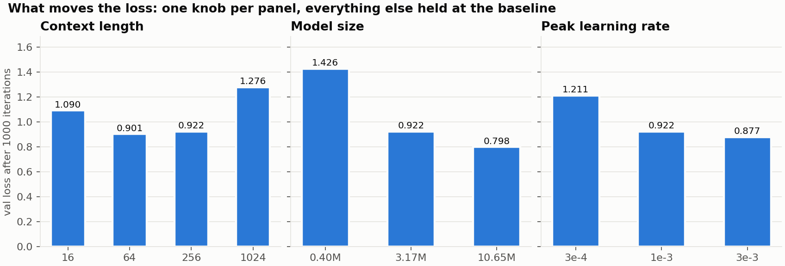
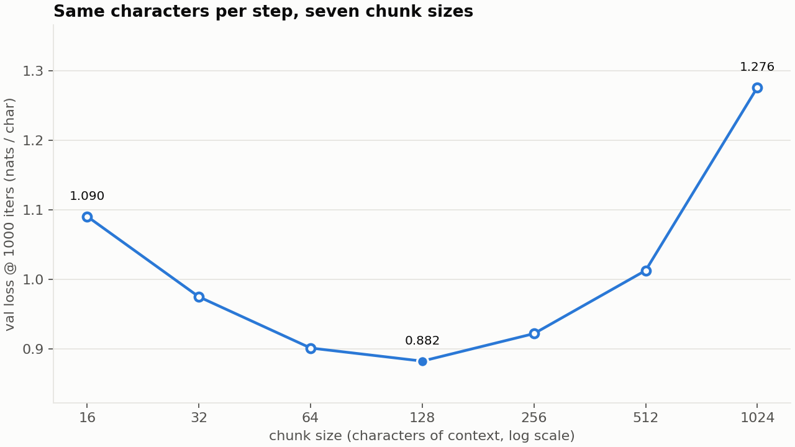
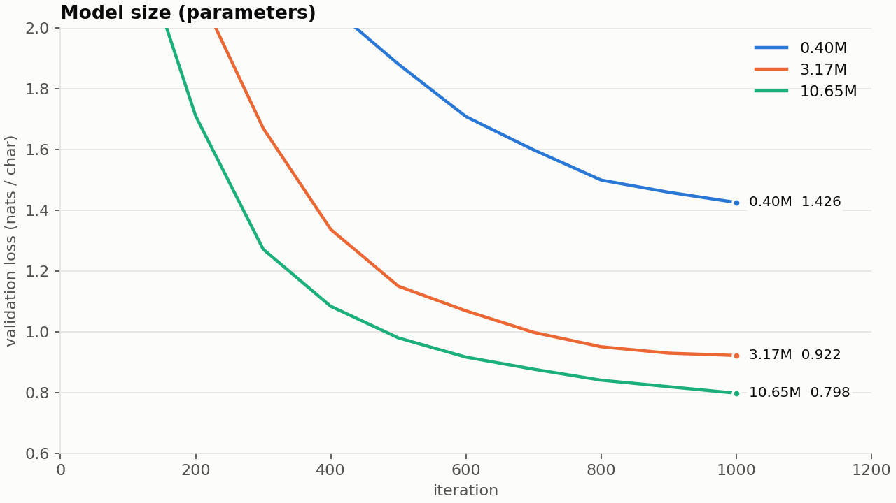
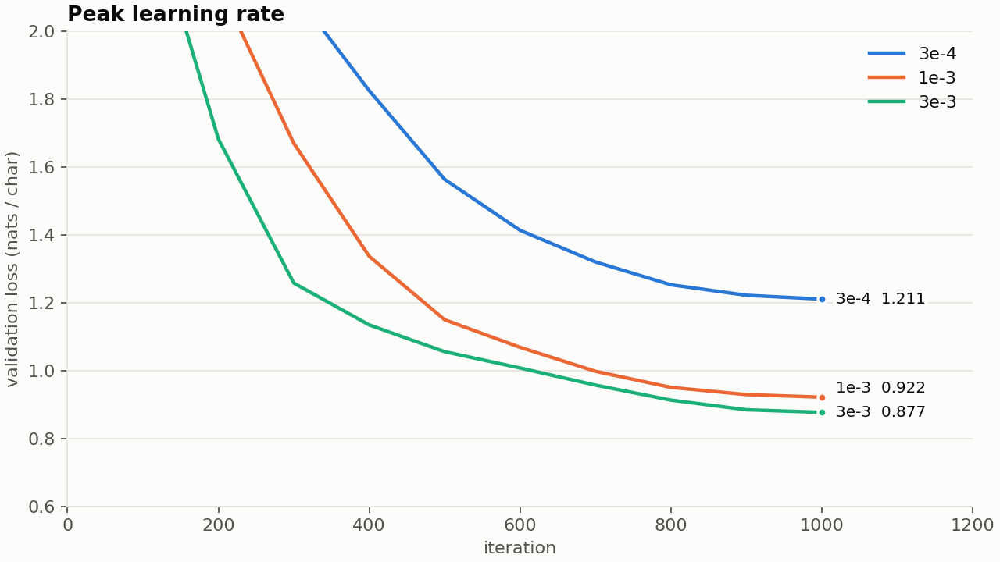

# FedSpeak experiments: what moves the loss

The main FedSpeak run trains a 10.65M-parameter character model to a
validation loss of 0.698 nats per character in 29 minutes. This write-up asks
which of the choices behind that number actually matter, by changing one
thing at a time and holding everything else fixed. It ends with two
measurements on the finished model that a loss curve alone can't show: how
hard each of the three sources is, and how the text changes as the model
learns.

All numbers come from the CSV logs in `results/experiments/` and
`results/`, produced by `run_experiments.sh`, `eval_by_source.py`, and
`sample.py`. Figures are drawn by `plot_results.py`.

## Setup

Every ablation run is the same recipe:

| | |
|---|---|
| Baseline model | 4 layers, 4 heads, 256-wide, 3.17M parameters |
| Budget | 1000 iterations at 16,384 characters per iteration = 16.4M characters, half of one pass over the corpus |
| Schedule | 100 warmup iterations, cosine decay from the peak rate to 10% of it |
| Evaluation | every 100 iterations, 20 batches each of train and validation |
| Validation set | the last 10% of the date-ordered corpus, every document from 20 September 2023 onward |
| Hardware | Apple M4, MPS, one run at a time |

The baseline is deliberately smaller than the main model so that eight runs
fit in an hour. One run changes one knob; the run labelled *baseline* in each
axis below is the same single run, `ctx0256`.

Characters per iteration are held constant when context length changes, so
a run with 16-character context sees 1024 sequences per step and a run with
1024-character context sees 16. That's the fair comparison for "same data,
same compute", and it is also the source of the most interesting result.

## Results at a glance



| Axis | Run | Change from baseline | Val loss @ 1000 | Wall time |
|---|---|---|---|---|
| context | `ctx0016` | 16 chars of context, 1024 seqs/step | 1.090 | 4.2 min |
| context | `ctx0064` | 64 chars, 256 seqs/step | **0.901** | 4.3 min |
| context | `ctx0256` | baseline: 256 chars, 64 seqs/step | 0.922 | 5.2 min |
| context | `ctx1024` | 1024 chars, 16 seqs/step | 1.276 | 10.9 min |
| size | `size0.4M` | 2 layers, 2 heads, 128-wide (0.40M) | 1.426 | 1.3 min |
| size | `ctx0256` | baseline: 3.17M | 0.922 | 5.8 min |
| size | `size10.6M` | 6 layers, 6 heads, 384-wide (10.65M) | 0.798 | 14.7 min |
| learning rate | `lr3e-4` | peak 3e-4 | 1.211 | 5.4 min |
| learning rate | `ctx0256` | baseline: peak 1e-3 | 0.922 | 5.8 min |
| learning rate | `lr3e-3` | peak 3e-3 | **0.877** | 6.2 min |

For scale: the uniform-guess loss over 86 characters is 4.45, and the main
run reaches 0.698 with the 10.65M model after twice this budget.

## Context length: a real optimum, not a plateau



The first version of this sweep tested four sizes, 16, 64, 256 and 1024, and
concluded that 64 and 256 were tied and that context beyond 64 bought nothing.
Filling in 32, 128 and 512 shows that was an artifact of where the points
landed. The curve is a clean U with a distinct minimum:

| Chunk size | Sequences per step | Val loss @ 1000 |
|---|---|---|
| 16 | 1024 | 1.090 |
| 32 | 512 | 0.975 |
| 64 | 256 | 0.901 |
| 128 | 128 | **0.882** |
| 256 (baseline) | 64 | 0.922 |
| 512 | 32 | 1.013 |
| 1024 | 16 | 1.276 |

Every run sees the same 16,384 characters per step, so halving the chunk size
doubles the number of independent sequences in each gradient. The minimum sits
at **128 characters** (0.882), and 64 and 256 are not tied by
coincidence, they are the two shoulders on either side of it. Four points had
stepped over the answer.

Three effects are competing, and the sweep cannot fully separate them:

1. **Most predictable structure in English-like text is local.** The next
   character depends overwhelmingly on the previous few dozen. At 128
   characters a model can see the current word, the previous two or three, and
   usually the start of the sentence. That is where the return flattens.
2. **Fewer sequences per step means noisier gradients.** At 1024 characters the
   gradient is averaged over 16 document slices instead of 1024, and 1000 steps
   is not enough to average that noise away. This is why the right-hand side of
   the curve rises so steeply.
3. **Long context takes longer to learn to use.** The over-time curves
   (`results/figures/ablation_context.png`) show it
   directly: the 16-character model has the lowest loss until iteration 250,
   the 64-character model until 800, and the 256-character model only draws
   level in the last 200 iterations while still falling faster than the others.

A caveat that matters for reading the table: **each model is scored in windows
of its own chunk size**, so the axis mixes "long context helps the model learn"
with "long context helps the model predict". A model trained at 16 characters
is also only ever tested with 16 characters of history. The next section
separates the two.

### How much of this is noise?

The whole sweep was run a second time at the same seed on an idle machine, both
to get honest timings and to see how repeatable it is. Nine runs completed
before the machine's Metal compiler service failed and took the rest with it.

| Run | First pass | Second pass | Difference |
|---|---|---|---|
| ctx 16 | 1.0904 | 1.0911 | 0.0007 |
| ctx 32 | 0.9749 | 0.9740 | 0.0009 |
| ctx 64 | 0.9013 | 0.9040 | 0.0027 |
| ctx 128 | 0.8825 | 0.8823 | 0.0002 |
| ctx 256 | 0.9220 | 0.9214 | 0.0006 |
| ctx 512 | 1.0128 | 1.0074 | 0.0054 |
| ctx 1024 | 1.2758 | 1.2744 | 0.0014 |
| 0.40M | 1.4256 | 1.4290 | 0.0034 |
| 10.65M | 0.7979 | 0.7965 | 0.0014 |

**Same seed, same data, same code, and the answers still move by up to 0.005.**
GPU kernels are not bit-for-bit deterministic, so every number here carries a
floor of roughly half a hundredth of a nat before seed variation is even
considered. That sets the scale for reading the rest of this document:

- The chunk-size minimum at 128 beats its neighbours by 0.018 to 0.039, about
  four to eight times that floor, so it survives. It is a real effect measured
  at a coarse resolution, not a precise optimum.
- The learning-rate gain of 0.045 and the size gains of 0.12 and 0.50 are far
  above the floor.
- Anything reported here to the fourth decimal place is spurious precision.

A three-seed study of the 64, 128 and 256 runs was started and did not finish;
see the caveats below.

The timings in the table above are from this clean second pass. The first
pass's numbers were unusable because runs overlapped with other jobs: the
512-character run reported 41.7 minutes then and takes 6.8 on an idle
machine.

## Scored fairly, the answer moves

The table above scores each model in windows of its own chunk size, averaging
over every position, including the first few, which have almost no history.
That punishes short-chunk models twice: they have less context *and* a larger
share of their scored predictions are made with very little of it.

`eval_common_context.py` removes the second effect. Every model is scored on the
same 60,000 validation characters, and for each one it is given as much history
as its chunk size allows. Only the last 4 predictions of each window count, so
every scored character is predicted with close to the model's full context.
The masked-loss path was checked against a direct computation before use.

| Chunk size | Own-window loss | Same targets, full context |
|---|---|---|
| 16 | 1.090 | 0.820 |
| 32 | 0.975 | 0.795 |
| 64 | 0.901 | **0.785** |
| 128 | **0.882** | 0.806 |
| 256 | 0.922 | 0.854 |
| 512 | 1.013 | 1.003 |
| 1024 | 1.276 | 1.303 |

Three things change:

- **The optimum moves from 128 to 64.** Under fair scoring the 64-character
  model is best.
- **The left side of the U almost disappears.** From 16 to 64 characters the
  fair loss improves by only 0.035, against 0.19 under own-window scoring. Most
  of the apparent benefit of longer chunks at the short end was the evaluation
  penalising early positions. Given its full 16 characters, about three words,
  the smallest model predicts nearly as well as the best one: most of what
  makes the next character predictable is inside the current word.
- **The right side does not move.** At 512 and 1024 both scoring methods agree,
  so the collapse is a genuine learning cost (16 sequences per gradient is too
  few in 1000 steps), not an evaluation artifact.

The absolute values in the two columns come from different slices of the
validation text and should not be subtracted from each other. The comparison
that is fair is down each column: every model in the right-hand column was
scored on exactly the same characters.

The lesson for the write-up as a whole: **how a model is evaluated changed
which chunk size looked best.** The own-window number is what a training loop
reports by default, and on this axis it was misleading.

## Model size: the biggest lever



| Parameters | Val loss @ 1000 | Time |
|---|---|---|
| 0.40M | 1.426 | 1.2 min |
| 3.17M | 0.922 | 5.8 min |
| 10.65M | 0.798 | 14.1 min |

Eight times the parameters buys half a nat between the tiny and baseline
models. Another 3.4x buys a further 0.12, to 0.798, at 2.4x the wall time. The tiny model's samples are recognisably Fed-flavoured but
cannot spell reliably; the difference between 1.43 and 0.92 is roughly the
difference between "accommodity" and "accommodative".

Every step of the bigger model costs more, so at fixed *wall time* rather
than fixed iterations the picture is closer than the table suggests. The
0.4M model could run 5000 iterations in the time the 3.2M model runs 1000.
Whether that would close the gap is the question the scaling-laws literature
answers with "partly, and predictably". Here it was not tested.

## Learning rate: the default was too cautious



| Peak learning rate | Val loss @ 1000 |
|---|---|
| 3e-4 | 1.211 |
| 1e-3 (nanoGPT's char default) | 0.922 |
| 3e-3 | **0.877** |

A 3x lower rate costs 0.29 nats: the model just hasn't travelled far enough
in 1000 steps. A 3x higher rate *gains* 0.045 with no sign of instability in
the step log. nanoGPT's default of 1e-3 was tuned for 5000 iterations over a
1.1M-character corpus, where the model sees the data 75 times and a gentler
rate helps it settle. In a single pass over a large corpus, the model is
under-trained rather than over-fitted, and a more aggressive rate helps.

### It did not transfer

The obvious next step was to apply this to the headline model: the same
10.65M-parameter, 2000-iteration run that scored 0.698, changing only the peak
learning rate from 1e-3 to 3e-3. It got worse.

| Model | Peak lr | Val @ 1000 | Val @ 2000 |
|---|---|---|---|
| 3.17M, 1000 iters (ablation) | 1e-3 | 0.922 | |
| 3.17M, 1000 iters (ablation) | 3e-3 | **0.877** | |
| 10.65M, 2000 iters (headline) | 1e-3 | **0.819** | **0.698** |
| 10.65M, 2000 iters (headline) | 3e-3 | 0.862 | 0.708 |

The higher rate trailed for the whole run, not just at the end. A
hyperparameter tuned on a smaller, shorter proxy did not carry over to the
model it was meant to improve. This is a well-known failure: the stable
learning rate typically falls as a network gets wider, which is the problem
maximal-update parameterisation (muP) was designed to solve by making the
optimum transfer across width. Without it, the learning rate has to be tuned at
the scale you intend to use. The headline model keeps 1e-3.

## Per-source difficulty: statements are the easiest text

Measured on the final 10.65M model, over the validation portion of each
source (documents from 20 September 2023 onward), in non-overlapping
256-character windows. `results/loss_by_source.csv`.

| Source | Val documents | Characters scored | Loss (nats/char) | Bits/char |
|---|---|---|---|---|
| FOMC statements | 25 | 48,896 | **0.427** | 0.62 |
| FOMC minutes | 24 | 1,115,904 | 0.631 | 0.91 |
| Beige Books | 24 | 2,541,312 | 0.722 | 1.04 |

The prediction going in was the opposite: statements are 1.6% of the corpus,
so the model has seen the fewest of them, and they should be hardest. They
are the easiest by a wide margin, because they are the most formulaic.
Consecutive statements reuse whole sentences verbatim ("The Committee seeks
to achieve maximum employment and inflation at the rate of 2 percent over
the longer run"), so a model that has seen two years of them can predict the
next one almost character for character. The Beige Book, two thirds of the
training data, is the hardest, because twelve districts each describe
different businesses in different words every six weeks.

Loss per character is a measure of *novelty*, not of importance. The
source that dominates training is the one the model is least sure about,
and the source it barely saw is the one it can nearly recite.

## Temperature: the same model, five personalities

`results/temperature_sweep.txt` has the full samples. All from the same
prompt and seed, top-k 40.

| Temperature | What happens |
|---|---|
| 0.3 | Grammatical, on-register, and stuck. It reproduces the most common directive language nearly verbatim and then loops: "at a pace of $5 billion per month per month". |
| 0.6 | Fluent with occasional grammatical slips ("the continuing necessary to continue to monitor"). Best trade-off for reading as Fed prose. |
| 0.8 | The setting used for the headline samples. Every clause plausible, the sentence drifts. |
| 1.0 | Spelling starts to go: "experting", "Recessary". Section headings appear mid-paragraph. |
| 1.3 | "cudit candidates", "pipelined perceived". Individual words are still mostly real; the sequence is noise. |

Temperature doesn't change what the model knows. It changes how much of its
probability distribution you let it sample from. Low temperature shows what
it is *most* sure of, which for this corpus is boilerplate; high temperature
shows the long tail, which is where the fabrication becomes visible as
misspelling rather than as confident nonsense.

## Watch it learn: samples along the main run

The main run was repeated with a checkpoint saved at every evaluation
(`train.py --save_every_eval`; it reproduced the original to within 0.001,
val 0.6977 vs 0.6981). Each checkpoint was given the same prompt, "The
Committee decided to", at temperature 0.8. Full text in
`results/samples_by_iteration.txt`; first 110 characters of each here.

| Iter | Val loss | Sample continues... | What it has learned |
|---|---|---|---|
| 0 | 4.575 | `DXCvB))YMt9,rr1bZ1YYbhA2x 3;;DDcFQQtVd*[XLLMTx1V.5l426gpPPZP` | Nothing. Uniform noise over 86 characters. |
| 200 | 1.716 | `thest pricipate temboker a were Rited of firme sllowe hightly acciparted conths` | Letters come in pronounceable runs, spaces land every 4 to 8 characters, capitals start words. English-shaped, no English. |
| 400 | 1.093 | `these providerest since the sector for the Treasury, and gas support that the ropments largely pressure` | Most short words are real. Long words are blends ("providerest"). Line breaks and a section heading ("Agriculturism") appear. |
| 600 | 0.943 | `an its longraper. The price sector for commercial developments in the first three monthly in the District` | Beige Book vocabulary and phrase shapes: "in the District", "commercial developments". Grammar still fails at clause boundaries. |
| 800 | 0.868 | `anticipate increased moderately. Nearly accounts in confidence that had remained modestly in early 2018` | Hedging adverbs in the right slots ("moderately", "modestly"). A plausible year. Sentences start and end where sentences do. |
| 1000 | 0.819 | `current the Committee to achieve maximum employment, the minutes and properties assumed at the Federal Reserve's holdings` | First verbatim policy phrase: "to achieve maximum employment". The prompt's "Committee" has pulled it toward minutes register. |
| 1200 | 0.771 | `considerably consistent with the its decision to lower growth and the federal funds rate at least consistent with` | Statement vocabulary ("federal funds rate", "its decision") but repetitive: "consistent with" twice in 20 words. |
| 1400 | 0.747 | `maintain the target range for the term of the federal funds rate at this meeting in assessing the economic outlook` | "maintain the target range for the federal funds rate" is the real statement formula, nearly intact. |
| 1600 | 0.715 | `consider appropriate monetary policy, and in the labor market appeared to have remains largely unchanged` | Whole clauses lifted correctly; the join between them is where the errors now live ("appeared to have remains"). |
| 1800 | 0.702 | `keep the target range for the federal funds rate at 1 to 1-3 percent. Voting for the FOMC monetary policy action were: Ben S. Bernanke, Chairman` | The full statement structure: decision, then the voting roster with a real Chairman and a real Vice Chairman. The range "1 to 1-3 percent" is malformed. |
| 2000 | 0.698 | `keep the target range for the federal funds rate lower in the longer run. To support sell inflation expectations, over the medium term` | Fluent statement register throughout. Reads as Fed prose at a glance and means nothing on inspection. |

The order in which things are learned is the order of their statistical
strength: character frequencies, then spelling, then short words, then
collocations, then sentence templates, then document structure. Everything
that arrives late is what makes the output *look* authoritative, and none
of it is grounded in anything but the preceding characters. The loss halves
between iterations 200 and 400 and the text goes from gibberish to
almost-words; it falls another 0.12 between 1400 and 2000 and the text goes
from almost-statements to statements. The second change is smaller in
nats and far larger in how convincing the output is, which is exactly the
gap between what the loss measures and what a reader sees.

## How far the same mechanism goes

Nothing in this project is different in kind from what trains a frontier
model: the same next-token objective, the same transformer block, the same
AdamW and cosine schedule. What differs is scale. `results/scale_table.csv`.

| Model | Parameters | Training tokens | Training compute (FLOPs) | vs FedSpeak |
|---|---|---|---|---|
| FedSpeak main run | 10.7M | 33M characters | 2.1e15 | 1x |
| nanoGPT shakespeare_char | 10.7M | 82M characters | 5.2e15 | 2.5x |
| GPT-2 (1.5B, 2019) | 1.5B | ~10B (estimate) | ~9e19 | ~40,000x |
| GPT-3 (2020) | 175B | 300B | 3.1e23 (published) | 150,000,000x |
| Llama 3.1 405B (2024) | 405B | 15.6T | 3.8e25 (published) | 18,000,000,000x |

FedSpeak's compute is estimated as 6 x parameters x tokens, the standard
approximation. GPT-3 and Llama 3.1 figures are from their papers; the GPT-2
token count is an estimate from the reported 40 GB of WebText. Between this
laptop and Llama 3.1 sit ten orders of magnitude, and every one of the
failure modes documented in `results/annotated_sample.md` (fabricated dates,
inconsistent roles, fluent drift) is a failure mode that persists across
them, just at longer range and with better spelling.

## Caveats

- **One seed per run, and the re-run above measures the floor.** Repeating the
  sweep at the same seed moved answers by up to 0.005, so differences of 0.02
  are suggestive rather than established and differences of 0.2 are certain. A
  three-seed comparison of chunk sizes 64, 128 and 256 was launched to settle
  the middle ground and could not complete: the machine's Metal compiler
  service failed partway through the batch, aborting the remaining eight runs
  instantly. That study is still outstanding.
- **1000 iterations is a short budget.** Every ranking here is "at this
  budget". Learning rate and context length in particular are known to
  change their optimum with training length.
- **Validation loss depends on the context length being evaluated.** Each
  run is scored in windows of its own block size, so a 16-context model is
  scored with at most 16 characters of context. That is the honest measure
  of what the model can do, but it means the context axis mixes "how much
  context helps learning" with "how much context helps prediction".
- **The chronological split favours the formulaic.** Validation is the most
  recent 10% of documents. A source whose recent documents closely repeat
  earlier ones (statements) will score well partly for that reason.

## Reproduce

```
./run_experiments.sh             # eleven runs, ~75 min on an idle M4
python3 eval_by_source.py        # per-source loss of the headline model
python3 eval_common_context.py   # scores every chunk size on identical targets
python3 plot_results.py          # writes results/figures/*.png
```

Each run writes `runs/<name>/eval_log.csv`; copy those into
`results/experiments/<name>/` for `plot_results.py` and the web page to pick
them up. Losses are deterministic given the seed, so they reproduce exactly.
Wall-clock times do not: run the sweep on an otherwise idle machine if you want
the timings to mean anything.
