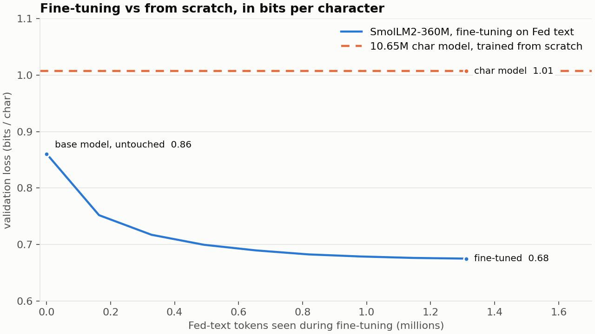

# FedSpeak, phase 2: fine-tuning a pretrained model

Phase 1 trained a 10.65M-parameter character model from random weights and
found it could reproduce the Fed's register but not hold a thought past a
clause. This phase asks what changes when the same corpus is used to
*continue pretraining* a small open model that already knows English:
SmolLM2-360M, fine-tuned for one hour on a 16 GB laptop.

The mechanism is unchanged. Same next-token objective, same AdamW, same
cosine schedule, same chronological validation split. What differs is that
the weights start from 4 trillion tokens of prior training instead of from
noise, and the corpus is read as BPE tokens instead of characters.

Everything here is reproducible with the scripts in `finetune/`, and every
number is in `results/finetune/`.

## Setup

| | |
|---|---|
| Base model | [SmolLM2-360M](https://huggingface.co/HuggingFaceTB/SmolLM2-360M), 362M parameters, Apache 2.0 |
| Data | the same 747 cleaned documents, each prefixed with a header like `[FOMC statement \| 2010-01-27]`, separated by end-of-text; 6.84M tokens at 5.39 characters per token |
| Split | chronological, same boundary as phase 1: validation is every document from 20 September 2023 |
| Training | 320 steps x 4 windows x 1024 tokens = 1.31M tokens, 21% of the training split, one pass |
| Optimiser | AdamW, peak 3e-5, 10-step warmup, cosine to 3e-6, weight decay 0.01, clip 1.0 |
| Memory | fp32 master weights, bfloat16 autocast, gradient checkpointing, micro-batch of 1 with 4-step accumulation |
| Hardware | Apple M4, 16 GB, MPS: 11 to 25 s per step, 88 minutes total |

The headers are the one addition to the data. They cost nothing during
training and make the fine-tuned model *promptable by source and date*.

### Why these engineering choices

A first attempt at batch 4 x 1024 in fp32 ran at 70 tokens per second with
14 GB resident: the machine was swapping. Three changes brought it to about
360 tokens per second at 8.7 GB:

- **bfloat16 autocast** for the matrix multiplies. Turning it off dropped
  throughput to 13 tokens per second, so on MPS this is not optional.
- **Gradient checkpointing**, which recomputes activations during the
  backward pass instead of storing them. Removing it gained 7% speed and
  cost 4 GB of headroom, not a good trade at 16 GB.
- **Micro-batch of one** with gradients accumulated over four windows, which
  is arithmetically a batch of four without ever holding four in memory.

Even so the run was paced by memory, not compute: step times alternated
between 14 and 25 seconds as macOS reclaimed pages. A machine with 32 GB
would run this at roughly twice the speed with no code change.

## The loss curve



| Step | Tokens seen | Train | Val | Val, bits/char |
|---|---|---|---|---|
| 0 (base model, untouched) | 0 | 3.130 | 3.215 | 0.86 |
| 40 | 0.16M | 2.717 | 2.809 | 0.75 |
| 80 | 0.33M | 2.579 | 2.680 | 0.72 |
| 120 | 0.49M | 2.512 | 2.614 | 0.70 |
| 160 | 0.66M | 2.470 | 2.576 | 0.69 |
| 200 | 0.82M | 2.444 | 2.550 | 0.68 |
| 240 | 0.98M | 2.425 | 2.536 | 0.68 |
| 280 | 1.15M | 2.416 | 2.527 | 0.68 |
| 320 | 1.31M | 2.410 | 2.522 | 0.68 |

Loss is nats per token. Bits per character divides by ln 2 and by 5.39
characters per token, which is the unit that puts this model on the same
axis as phase 1.

Three things to read off the table:

- **The base model already beats the character model.** Before seeing a
  single Fed document, SmolLM2-360M scores 0.86 bits per character on Fed
  text. The 10.65M character model, after a full pass over the corpus, scores
  1.00. Knowing English is worth more than knowing the Fed.
- **Most of the gain arrives in the first 40 steps.** 0.41 nats in the
  first 160k tokens, then 0.13, 0.07, 0.04, and diminishing from there. The
  model isn't learning language; it's learning which part of the language
  it already has to stay in, and that is a small adjustment.
- **No overfitting.** Train and val fall together; the gap at the end
  (0.11) is the same as at the start (0.09). One pass over a fifth of the
  corpus is well short of memorisation for a model this size.

## Before and after, same prompt

Full text of every sample in `results/finetune/samples_base.txt` and
`samples_finetuned.txt`. Same seed and sampling settings for both.

Prompt: `[FOMC statement | 2026-10-28]`

**Base model:**

> The "3% in the last year" is not a good idea. The Fed will continue to
> buy $19 billion of bonds each month, but it won't be able to buy them all
> at once because market interest rates are so low [...]
>
> I am confused by this article. It says the FOMC should announce an
> official plan to lower short term rates. Is the goal to reduce inflation?

**Fine-tuned:**

> The Federal Reserve increased its policy rate to the lowest level since
> November of 2023. This change was prompted by uncertainty surrounding the
> COVID-19 pandemic, as well as efforts to maintain low inflation and
> support growth in economic activity. The FOMC agreed that monetary policy
> would be gradual but persistent at these levels for some time [...]
>
> Voting for the action included Ben Bernanke, Janet L. Yellen, Jerome H.
> Powell, Michael P. O'Dowd, and David Neira. Voting against this measure
> were Daniel K. Tarullo; Jeffrey M. Lacker, Susan S. Kelley, Stephen J.
> Bowers, and John C. Williams.

The base model knows what the FOMC is and writes fluent English in the
register of an internet comment thread, including a reader who is "confused
by this article". The fine-tuned model writes a statement: a policy
sentence, a rationale, a forward-guidance sentence, and a voting paragraph.

Prompt: `[Beige Book | 2026-10-15]`

**Base model:**

> The "Beige Book" is a financial document that contains the country's
> economic data. It's produced by an organization called Banco de Espana
> (Bank of Spain), which in turn reports to the Bank of Spain [...]

**Fine-tuned:**

> The Federal Reserve Board estimates that the probability of a decline in
> commodity prices exceeding 3 percent for most commodities during this
> year's second quarter is about one-half [...]
>
> Fiscal Policy
> The Committee expects fiscal policy conditions to remain accommodative
> over coming months. Fiscal authorities generally met their stated goals of
> maintaining sustainable budget balances while providing substantial
> stimulus to aggregate demand.

## What fine-tuning bought, and what it didn't

Compared with the phase 1 character model, the fine-tuned model:

- **Holds a topic for a paragraph.** The statement sample stays on policy
  for four sentences and then does the voting paragraph. The character
  model's samples drifted within a clause.
- **Produces whole document structures on request.** A header prompt yields
  that source's shape: statements get a voting paragraph, minutes get
  section headings like "Open Market Operations", Beige Books get topical
  sections.
- **Uses real names in plausible roles.** Bernanke, Yellen, Powell, Tarullo,
  Lacker, and Williams are all people who have voted at the FOMC.

And it still fabricates everything:

- **"increased its policy rate to the lowest level since November of
  2023"** is a self-contradiction inside one sentence, written with complete
  fluency.
- **The voting roster mixes four real officials with four who never
  existed** ("Michael P. O'Dowd", "David Neira", "Susan S. Kelley", "Stephen
  J. Bowers"), across three different eras, in a 2026 statement.
- **The Beige Book has a "Fiscal Policy" section**, which no real Beige Book
  has. The model learned that Beige Books have topical headings and
  invented a plausible one.
- **The minutes sample quotes "Mr. Trump"** on inflation expectations at an
  FOMC meeting, and then has "Mr. McDonough", whose last roster appearance as
  Vice Chairman in the corpus is in 2003, continue the discussion. Real names, real register,
  impossible scene.

This is the same failure as phase 1, one level up. The character model
fabricated at the level of dates and roles because it had learned the shape
of dates and roles. This model fabricates at the level of arguments and
meetings because it has learned the shape of arguments and meetings. Fluency
went up by a lot. Truthfulness did not move, because nothing in the training
signal refers to the world.

## Per-source difficulty, before and after

Validation documents from 20 September 2023 onward, scored in windows of up to
1024 tokens, headers included. `results/finetune/loss_by_source.csv`; the
phase 1 column is from `results/loss_by_source.csv`.

| Source | Char model (phase 1) | Base SmolLM2-360M | Fine-tuned | Fine-tune gain |
|---|---|---|---|---|
| FOMC statements | 0.62 | 0.72 | **0.49** | 0.22 |
| FOMC minutes | 0.91 | 0.80 | **0.61** | 0.20 |
| Beige Books | 1.04 | 0.86 | **0.69** | 0.17 |

All values in bits per character; lower is easier to predict.

Three readings:

- **Fine-tuning helps every source, and helps statements most.** The gain is
  0.22 bits per character on statements, 0.20 on minutes, and 0.17 on Beige
  Books. The most formulaic source is the one a fine-tune can learn most
  completely from a fifth of a pass.
- **The character model beats the untouched base model on statements.** 0.62
  against 0.72. A 10M-parameter model that has read every statement since 1994
  can recite their boilerplate better than a 360M model that has read the
  internet. On minutes and Beige Books, where the text is varied, the base
  model's general English wins by a wide margin.
- **The ordering of difficulty is the same for all three models.** Statements
  easiest, Beige Books hardest. That is a property of the text, not of the
  model: repetition makes statements predictable and twelve districts of
  fresh anecdotes make the Beige Book unpredictable, whatever is doing the
  predicting.

## Going bigger: Qwen3-1.7B with LoRA

The obvious next question is whether a stronger open model does better. It
does, and getting there needed one change of technique.

### What fits on a 16 GB laptop

Full fine-tuning costs roughly 16 bytes per parameter once AdamW's optimizer
state is counted, so the 360M model was already near the ceiling. Past about
500M parameters the method has to change: **LoRA** freezes every pretrained
weight, which lets them sit in bfloat16 at 2 bytes each, and trains a small
low-rank update beside each attention and MLP projection instead. Here that is
17.4M trainable parameters out of 1.74B, or 1.0%, and the saved result is a
77 MB adapter rather than a 1.4 GB model.

Benchmarking decided the model, not preference:

| Candidate | Licence | Fits in 16 GB? | Speed |
|---|---|---|---|
| Qwen3-1.7B-Base | Apache 2.0 | yes, 7.4 GB peak | 143 tokens/s |
| Qwen3-4B-Base | Apache 2.0 | no, 13.8 GB peak, swaps | 15 tokens/s |
| Llama 3.2 3B, Gemma 3 4B | gated | not tested, needs a licence click-through and a token | |

Qwen3-4B technically loads, but it pushes a 16 GB machine into swap and one run
would take about a day. **Qwen3-1.7B-Base is the practical ceiling here.** To go
further on Apple silicon the route is MLX, which supports 4-bit quantised LoRA
and would bring 4B and larger back into range.

### Keeping the comparison fair

Two details matter, and both are easy to get wrong:

- **Token storage.** Qwen3's vocabulary has about 151,000 entries, which does
  not fit the 16-bit integers the SmolLM2 data used. The ids are stored as
  32-bit instead.
- **The same validation documents.** A different tokenizer moves the 90% token
  boundary onto a different document, so validation is pinned to the same 73
  documents, everything from 20 September 2023. Qwen3's tokenizer is slightly
  more efficient on this corpus, 5.55 characters per token against 5.39.

Everything else is held constant: the same corpus, the same headers, the same
1.31M-token budget, the same sequence length and batch shape.

### The result

Both runs, converted to bits per character so the tokenizers cancel out:

| Tokens seen | SmolLM2-360M, full fine-tune | Qwen3-1.7B, LoRA |
|---|---|---|
| 0, untouched | 0.861 | 0.765 |
| 164k | 0.752 | 0.662 |
| 328k | 0.717 | 0.638 |
| 655k | 0.690 | 0.617 |
| 983k | 0.679 | 0.609 |
| 1.31M | 0.675 | **0.605** |

Three things worth pulling out:

- **The bigger model starts ahead and stays ahead.** Untouched, Qwen3-1.7B is
  already better on Fed text than SmolLM2 was after a full fine-tune on it.
- **It passes the smaller model's final score after 164,000 tokens**, about an
  eighth of the budget and twenty minutes of training.
- **Training 1% of the weights was enough.** LoRA gave a 10% lower final loss
  than a full fine-tune of the smaller model, while writing a 77 MB file.

The ranking matches the phase 1 lesson from the other direction. There, model
size was the biggest lever among models trained from scratch. Here, the
quality of what you start from dominates everything else: the single most
effective thing you can do is begin from a better pretrained model.

### Per-source, all five models

Bits per character on the same validation documents; lower is easier to predict.

| Source | Char model | SmolLM2 base | SmolLM2 fine-tuned | Qwen3 base | Qwen3 LoRA |
|---|---|---|---|---|---|
| FOMC statements | 0.62 | 0.72 | 0.49 | 0.57 | **0.37** |
| FOMC minutes | 0.91 | 0.80 | 0.61 | 0.70 | **0.52** |
| Beige Books | 1.04 | 0.86 | 0.69 | 0.77 | **0.63** |

The ordering of difficulty is identical for all five models: statements
easiest, Beige Books hardest. That is a property of the text, not of any
model. The fine-tuned Qwen is best on every source, and its margin is largest
on statements, the most formulaic source, where it is 25% better than the
fully fine-tuned SmolLM2.

### And it still fabricates, more convincingly

Prompted with a statement header, the untouched Qwen3 writes the front page of
an academic paper, complete with plausible but wrong author names. It has no
idea what this header means. After fine-tuning it produces Fed-shaped documents
on demand, and this is what one of them contains:

> First District--Boston
> Second District--Chicago
> Third District--New York
> Fourth District--Philadelphia
> Fifth District--Minneapolis
> ...
> Eleventh District--Savannah

Every Beige Book in the training data lists these twelve mappings, and each one
appears **112 times, with no variation**. Only the first line here is right.
Savannah is not a Reserve Bank city at all; it appears three times in the whole
corpus as an ordinary place name.

That is the clearest result in this project. A model that has seen a simple
twelve-row lookup table 112 times, and that predicts this corpus better than
anything else here, still cannot reproduce the table. Next-token training
optimises for what is likely to come next, and after "Second District--" a
Federal Reserve city name is likely. Which one is a fact, and facts are not
what the objective rewards.

The same pattern shows up when it is asked a real question. The base model
answers like a textbook, explaining in general terms what the FOMC can do. The
fine-tuned model answers in the Committee's own voice, with sentences such as
"Inflation has been somewhat below 2 percent since early March." That sentence
has the cadence of a real statement and refers to nothing. **Fine-tuning made
the output more authoritative without making it more true**, which is the
project's thesis, restated one model size up.

## Is it usable?

For **generating Fed-register text on demand** by source and date: yes, in
the sense that the output reads as the right kind of document for a
paragraph or two, and a reader who does not check will not notice. That is
the usable thing, and it is also the dangerous thing.

For **anything that depends on the content being true**: no, and no amount
of further fine-tuning on this corpus changes that. The next step for a
model that can *answer questions about what the Fed said* is retrieval:
find the real paragraph in `data/clean/`, put it in the prompt, and let a
model summarise text it can see. That is a different project with a
different failure mode, and it would be the third phase.

## Reproduce

```
python3 -m pip install -r requirements-finetune.txt
```

SmolLM2-360M, full fine-tune:

```
python3 finetune/prepare_ft.py                        # tokenise with headers -> data/ft/
python3 finetune/finetune.py                          # ~90 min on a 16 GB M4
python3 finetune/sample_ft.py --prompt "[FOMC statement | 2026-10-28]"
python3 finetune/eval_ft_by_source.py --tag finetuned
python3 finetune/eval_ft_by_source.py --model HuggingFaceTB/SmolLM2-360M --tag base
```

Qwen3-1.7B, LoRA. The `--val_start` pin is what keeps the two runs comparable:
without it a different tokenizer moves the train/validation boundary onto a
different document.

```
python3 finetune/prepare_ft.py --model Qwen/Qwen3-1.7B-Base \
        --out_dir data/ft_qwen3-1.7b --val_start 20230920
python3 finetune/finetune.py --data_dir data/ft_qwen3-1.7b --lora_r 16 \
        --lr 2e-4 --min_lr 2e-5 --out_dir finetune/out_qwen3-1.7b   # ~2 h idle, longer under memory pressure
python3 finetune/sample_ft.py --model finetune/out_qwen3-1.7b/model \
        --prompt "[FOMC statement | 2026-10-28]"
python3 finetune/eval_ft_by_source.py --model finetune/out_qwen3-1.7b/model \
        --tag qwen_finetuned --data_dir data/ft_qwen3-1.7b \
        --out results/finetune_qwen/loss_by_source.csv
python3 finetune/eval_ft_by_source.py --model Qwen/Qwen3-1.7B-Base \
        --tag qwen_base --data_dir data/ft_qwen3-1.7b \
        --out results/finetune_qwen/loss_by_source.csv
```
